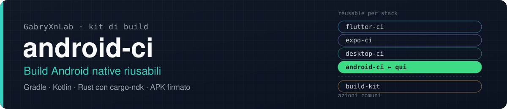

<p align="center">
  
</p>

<p align="center">
  <a href="https://github.com/GabryXnLab/flutter-ci">flutter-ci</a> ·
  <a href="https://github.com/GabryXnLab/expo-ci">expo-ci</a> ·
  <a href="https://github.com/GabryXnLab/desktop-ci">desktop-ci</a> ·
  <a href="https://github.com/GabryXnLab/android-ci"><b>android-ci</b></a> ·
  <a href="https://github.com/GabryXnLab/build-kit">build-kit</a>
</p>

<p align="center">
  
  
  <a href="LICENSE"></a>
  <a href="https://github.com/GabryXnLab/android-ci/commits/main"></a>
</p>

**APK di un'app Android nativa (Gradle, Kotlin, Compose) con la libreria Rust compilata da cargo-ndk, da un solo wrapper: sul runner self-hosted ARM64 o su quelli di GitHub, firmato col keystore giusto e consegnato su Telegram.**

## Perché

- **Stessi input della famiglia**: `runner`, `max_workers`, `clear_cache` hanno nome, valori e significato di `flutter-ci`, `expo-ci` e `desktop-ci`, perché li interpreta [`build-kit/setup`](https://github.com/GabryXnLab/build-kit#setup-worker-e-cache).
- **Rust incluso**: toolchain stable, cargo-ndk (in `~/ci/tools`, mai di sistema) e sccache condiviso; il progetto decide con un task Gradle quando compilarlo.
- **Firma verificata**: con `signing_keystore` l'APK si firma col keystore del runner (o dei secret) e l'impronta si confronta con quella attesa; keystore introvabile = job fallito, mai un APK firmato di debug che sembra buono.
- **Cache dove servono**: sul self-hosted quelle condivise della macchina, su GitHub `setup-gradle` e `rust-cache`, con `if` sul runner.
- **Esito su Telegram** con l'APK allegato, e artifact del run (3 giorni).

## Avvio rapido

```yaml
name: Build Android
run-name: Build Android${{ inputs.runner == 'github' && ' · GitHub' || '' }}
on:
  workflow_dispatch:
    inputs:
      runner:
        type: choice
        options: [self-hosted, github]
        default: self-hosted
jobs:
  android:
    uses: GabryXnLab/android-ci/.github/workflows/android-build.yml@main
    with:
      app_name: MiaApp
      runner: ${{ inputs.runner }}
      project_dir: android
      gradle_task: :app:assembleRelease
      abis: arm64-v8a,x86_64
      telegram_topic_id: '<id del topic>'
    secrets:
      TELEGRAM_BOT_TOKEN: ${{ secrets.TELEGRAM_BOT_TOKEN }}
      TELEGRAM_CHAT_ID: ${{ secrets.TELEGRAM_CHAT_ID }}
```

I secret si passano **per nome**, mai con `secrets: inherit`.

## Riferimento

| Input | Default | |
| :--- | :--- | :--- |
| `app_name` | obbligatorio | titolo delle notifiche |
| `runner` | `self-hosted` | `self-hosted` \| `github` |
| `max_workers` | `auto` | worker di Gradle/cargo: `auto` \| `2` \| `4` |
| `clear_cache` | `false` | cartelle del progetto sì, cache condivise mai (per il run non sono fidate) |
| `project_dir` | `.` | cartella con `gradlew` |
| `gradle_task` | `:app:assembleRelease` | task Gradle (con `debug`: `:app:assembleDebug`) |
| `abis` | `arm64-v8a,x86_64` | passate a Gradle come `-P<abis_property>=…` |
| `abis_property` | `riftgate.abis` | nome della proprietà Gradle delle ABI |
| `debug` | `false` | `:app:assembleDebug` |
| `signing_keystore` | `''` | nome del keystore (`/home/ubuntu/secrets/<nome>.jks` + `.properties`, o secret `ANDROID_KEYSTORE_BASE64` + `ANDROID_KEYSTORE_PROPERTIES`) |
| `rust` | `true` | toolchain Rust, cargo-ndk, sccache |
| `cargo_ndk_version` | `4.1.2` | |
| `cargo_target_in_checkout` | `false` | Gradle lancia cargo senza `CARGO_TARGET_DIR` |
| `ndk_version` | `27.3.13750724` | |
| `github_runner_label` | `ubuntu-24.04` | `runs-on` con `runner: github` |
| `selfhosted_runner` | `["self-hosted","nexus-core"]` | `runs-on` con `runner: self-hosted` |
| `ref`, `artifact_name` | `''` | commit da buildare; nome dell'artifact (default `app_name`) |
| `telegram_topic_id` | `''` | vuoto = nessuna notifica |

Secret, tutti facoltativi: `TELEGRAM_BOT_TOKEN`, `TELEGRAM_CHAT_ID`, `ANDROID_KEYSTORE_BASE64`, `ANDROID_KEYSTORE_PROPERTIES`.

## Per chi lo mantiene

`@main` è live per tutti: input nuovi con default, mai rinominati. Il repo è pubblico e deve restarlo. Vincoli e perché in [`CLAUDE.md`](CLAUDE.md); architettura comune nel `CLAUDE.md` di [`build-kit`](https://github.com/GabryXnLab/build-kit).
